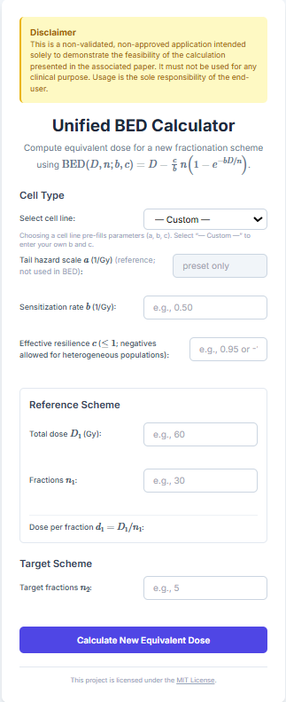

# Unified BED Calculator

💻 Interactive web calculator for the Unified Biologically Effective Dose (BED) framework, providing closed-form isoeffect solutions for radiation therapy.

**Live Demo:** [**https://joliverapps.github.io/Unified-BED-Calculator/**](https://joliverapps.github.io/Unified-BED-Calculator/)

---

> ⚠️ **Clinical Disclaimer**
>
> This is a non-validated, non-approved application intended solely to demonstrate the feasibility of the calculation presented in the associated paper. **It must not be used for any clinical purpose.** Usage is the sole responsibility of the end-user.

## Overview

This is a simple, static web application (HTML/JS/Tailwind CSS) that serves as the companion tool for the paper: *"First-principles Resilience-Depletion (RD) model unifying BED from conventional to hypofractionated dose"*.

The standard Linear-Quadratic (LQ) model fails to accurately predict cell survival at the high doses per fraction used in SBRT and SRS. This tool implements the survival model derived in our paper, which is based on the postulate of **proportional depletion of resilience**.

This framework yields a single, unified Biologically Effective Dose (BED) that is valid across all dose regimes, from conventional fractionation to extreme hypofractionation. This calculator provides a practical, closed-form solution to find isoeffective dose schedules using this new model.

## The Model

The calculation is based on the unified Biologically Effective Dose (BED) derived in the paper (Eq. \ref{eq:BED_bc}):

$$
\mathrm{BED}(D,n;b,c) = D-\frac{c}{b}\,n\Bigl(1-e^{-b D/n}\Bigr)
$$

Where:
* $D$ is the total dose.
* $n$ is the number of fractions.
* $b$ is the **sensitization rate**.
* $c$ is the **effective initial resilience**.

To find an equivalent total dose $D_2$ for a new schedule of $n_2$ fractions, the tool solves the isoeffect equation $\mathrm{BED}(D_1, n_1) = \mathrm{BED}(D_2, n_2)$. It uses the exact, closed-form solution derived in the paper (Eq. \ref{eq:D2_solution}), which relies on the principal branch of the **Lambert-$W$ function**:

$$
D_2=\frac{n_2}{b}\Bigl(K+W_0\!\bigl(-c e^{-K}\bigr)\Bigr)
$$

Where the intermediate term $K$ is defined as:

$$
K \coloneqq c+\frac{b}{n_2} \mathrm{BED}(D_1,n_1;b,c)
$$

This approach provides a single, consistent method for comparing all fractionation schedules without the limitations of the LQ model.

## Features

* **Calculate Equivalent Dose:** Find the equivalent total dose ($D_2$) and new dose-per-fraction ($d_2$) for a target number of fractions ($n_2$).
* **Closed-Form Solution:** Uses a direct, exact calculation via the Lambert-$W$ function (implemented in vanilla JavaScript).
* **Cell Line Presets:** Includes pre-filled parameters ($a, b, c$) for the cell lines analyzed in the paper (e.g., T-47D, A549, XRS5, etc.).
* **Custom Parameters:** Allows for manual entry of $b$ and $c$ for any tissue type.
* **Handles Heterogeneity:** The model and calculator correctly handle heterogeneous populations via an **effective negative resilience ($c < 0$)**, which describes biphasic survival curves (e.g., XRS5, XRS6).
* **Lightweight & Static:** Runs entirely in the browser. No server or build step required.

## License

This project is licensed under the **MIT License**. See the [LICENSE](LICENSE) file for details.
